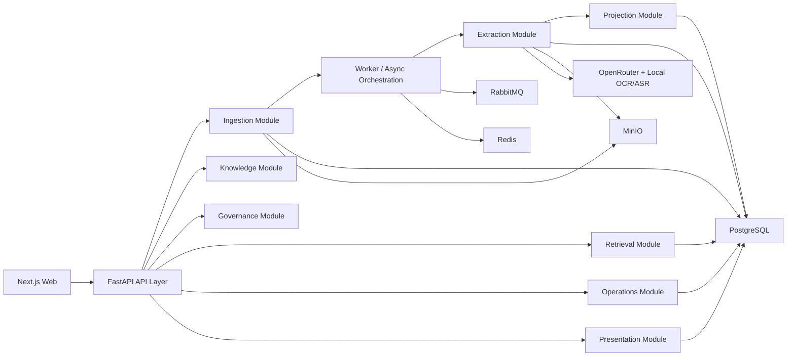

# Architecture V2 Blueprint

Last updated: `2026-04-21`

## Goal

Give the project a cleaner long-term architecture before formal launch, while preserving the parts that are already directionally correct:

- Docker-first deployment
- FastAPI + PostgreSQL + pgvector + RabbitMQ + Redis + MinIO
- raw asset preservation
- async extraction
- event-centric knowledge graph
- separate canonical knowledge and stylized story views

The project should **not** be rebuilt as microservices.

The recommended direction is:

- keep the current stack
- keep one deployable backend
- tighten domain boundaries
- make extraction and projection more versioned and auditable
- remove duplicated sources of truth in the data model

## Executive Decision

### Keep

- modular monolith architecture
- FastAPI as one backend boundary
- PostgreSQL as the canonical source of truth
- RabbitMQ + worker for slow AI and media jobs
- MinIO for raw and large derived artifacts
- Next.js for the web product

### Change

- move from layer-first service sprawl to domain-first module boundaries
- separate immutable extraction results from mutable canonical projections more explicitly
- remove duplicated graph truth across multiple tables where possible
- centralize embeddings and alias truth
- introduce a model/prompt/version registry for extraction and replay
- make operations and graph views read-model driven by design, not by convenience

## Current Architectural Strengths

- raw, derived, canonical, and presentation layers are conceptually separated already
- note -> extraction -> graph -> story is a sensible product pipeline
- review and curation are already split from core extraction
- graph and operations pages are already moving toward dedicated read models
- API response contracts are becoming explicit and testable

## Current Structural Risks

These are the main architectural risks before launch.

### 1. Service boundaries are still too horizontal

Current backend services are grouped mostly by technical function under `server/app/services`, which worked for MVP speed but will become harder to scale mentally:

- extraction orchestration
- projection writing
- graph querying
- review logic
- curation logic
- operations aggregation

This makes cross-domain ownership blurry.

### 2. Projection writes are too destructive

The current pipeline clears and rewrites current graph records directly. That is acceptable for MVP, but it creates risk around:

- replay safety
- auditing
- partial failure recovery
- future “compare before apply” workflows

### 3. Some data has two sources of truth

Examples:

- `entities.alias_json` and `entity_aliases`
- `note_chunks.embedding_vector` and `embeddings`
- graph semantics spread across `event_entities`, `relations`, `note_entities`, and `note_events`

This is manageable now, but expensive later.

### 4. The graph model is partly canonical and partly projection-like

The product is right to stay event-centric, but some link tables mix:

- provenance
- canonical graph facts
- UI query shortcuts

These should be separated more clearly.

### 5. Model and prompt versioning is still too weak

`extraction_runs` stores extractor name and version, but the system should be able to answer:

- which model generated this payload
- which prompt version was used
- which schema version was expected
- which local parser version contributed
- which projection version was applied

Without this, long-term replay and quality iteration will become noisy.

## Recommended Target Architecture

The target should stay a modular monolith with explicit domain modules.



## Target Backend Module Boundaries

Use domain-first packaging.

```text
server/app/
  api/
    v1/
      __init__.py
      router.py
  domains/
    auth/
    ingestion/
    extraction/
    projection/
    knowledge/
    governance/
    retrieval/
    operations/
    presentation/
  shared/
    db/
    messaging/
    storage/
    media/
    llm/
    responses/
    pagination/
    observability/
  workers/
  tasks/
```

### Domain responsibilities

#### `auth`

- login
- current-user identity
- auth policy

#### `ingestion`

- raw asset intake
- note creation entrypoint
- upload validation
- job enqueue requests

#### `extraction`

- OCR / ASR / multimodal normalization
- LLM orchestration
- immutable extraction run creation
- model and prompt version capture

#### `projection`

- apply an extraction result into canonical records
- maintain replay/apply workflow
- manage versioned projection state

#### `knowledge`

- canonical entities
- canonical events
- canonical relations
- timeline source facts and derived projections

#### `governance`

- merge review
- alias confirmation
- event/entity curation
- audit actions

#### `retrieval`

- search
- graph workspace reads
- library / people / event / timeline read models

#### `operations`

- jobs overview
- queue/backlog signals
- operator dashboards

#### `presentation`

- chunibyo story views
- future alternate presentation layers

## Recommended API Shape

The current `/api/v1` prefix is fine. The improvement should be conceptual grouping, not necessarily a breaking prefix change.

Recommended family structure:

```text
/api/v1/auth/*
/api/v1/ingestion/assets/*
/api/v1/ingestion/notes/*
/api/v1/knowledge/entities/*
/api/v1/knowledge/events/*
/api/v1/knowledge/timeline/*
/api/v1/retrieval/search/*
/api/v1/retrieval/graph/*
/api/v1/governance/review/*
/api/v1/governance/curation/*
/api/v1/operations/*
/api/v1/presentation/story/*
```

If keeping the current public paths is preferred, use this grouping internally first and introduce path changes only if desired.

### API principles

- commands and queries should stay separate
- route handlers should stay thin
- every public response should be schema-backed
- list surfaces should always be paginated or explicitly bounded collections
- graph and operations endpoints should remain dedicated read models

## Recommended Async Architecture

The current job queue is correct, but the internal workflow should be tightened.

### Target flow

1. user uploads raw asset
2. ingestion module creates note and `processing_request`
3. backend writes a durable outbox or dispatch record
4. worker consumes the processing command
5. extraction module writes immutable extraction run artifacts
6. projection module applies a chosen run into canonical graph state
7. operations module exposes job, backlog, and replay status

### Key improvements

- add an **outbox table** or equivalent dispatch log
- add **idempotency keys** for note processing and retry flows
- add **correlation ids** across API request, job, run, and projection
- split “extract” from “apply” conceptually even if they run in sequence

## Data Model Recommendations

The existing event-centric direction is correct. The optimization is to reduce overlap and clarify which tables are canonical versus derived.

## Canonical modeling decisions

### 1. Do not collapse everything into generic `graph_nodes`

Keep explicit tables for:

- `entities`
- `events`
- `relations`

This preserves semantics, validation, and queryability.

The graph workspace should be a **read projection**, not the database schema.

### 2. Keep `event_entities` as canonical participant facts

This table is valuable and should remain canonical because participation is a high-frequency domain concept.

Recommended rule:

- `event_entities` is canonical for event participation
- `relations` is canonical for non-participant graph edges
- do not duplicate `participates_in` in both places unless one is explicitly marked as derived

### 3. Replace alias dual-truth with one canonical source

Recommended final rule:

- `entity_aliases` is the canonical alias store
- `entities.alias_json` becomes a cache/projection field temporarily
- long term, `alias_json` should be removed or regenerated only for convenience payloads

### 4. Centralize embeddings

Recommended final rule:

- `embeddings` becomes the only long-term vector store
- `note_chunks.embedding_vector` should be migrated out

Recommended additions to `embeddings`:

- `owner_type`
- `owner_id`
- `embedding_scope` such as `note_chunk`, `entity_name`, `event_summary`
- `source_field`
- `model_name`
- `model_version`
- `run_id` or `source_run_id`

### 5. Clarify provenance links

`note_entities` and `note_events` should be treated as provenance / mention links, not as peer graph truth tables.

Recommended direction:

- keep them if they are useful for fast source lookup
- rename the concept internally to “mention links” or “source links”
- avoid letting them behave like canonical graph edges

### 6. Make extraction runs more explicit

Recommended additions to `extraction_runs`:

- `provider_name`
- `model_name`
- `prompt_version`
- `schema_version`
- `input_hash`
- `parent_run_id`
- `run_kind`
- `projection_status`

Large raw or normalized payloads can stay in JSON for now, but long term large artifacts should be stored in MinIO with DB metadata pointers.

### 7. Introduce projection versioning

This is the most important architectural improvement.

Instead of only “current canonical state”, introduce version-aware projection concepts:

- `projection_versions`
- `note_active_projection` or equivalent pointer

Recommended semantics:

- extraction run is immutable
- projection version is immutable
- active pointer is mutable

This makes:

- replay safer
- compare/apply cleaner
- rollback explicit
- audit easier

### 8. Keep timeline items as projection data

`timeline_items` should remain a derived read/projection table, not the ultimate source of truth.

Source of truth should stay in:

- event time fields
- participation and relation facts
- extraction provenance

## Suggested Database Refactor Map

| Current area | Recommended stance | Action |
| --- | --- | --- |
| `entities.alias_json` | cache only | migrate writes to `entity_aliases` |
| `entity_aliases` | canonical | enforce unique constraints and query through it |
| `note_chunks.embedding_vector` | transitional only | migrate to `embeddings` |
| `embeddings` | canonical vector store | extend metadata fields |
| `event_entities` | canonical participation facts | keep and add stronger uniqueness constraints |
| `relations` | canonical non-participant edges | avoid duplicate participant edges |
| `note_entities` / `note_events` | provenance links | treat as mention/source projection |
| `timeline_items` | derived projection | rebuild from canonical graph facts |
| `extraction_runs` | immutable extraction metadata | enrich versioning fields |

## Recommended Constraints And Indexing

Before launch, strengthen constraints rather than relying on application behavior alone.

Recommended examples:

- unique `(entity_id, normalized_alias)` on `entity_aliases`
- unique `(event_id, entity_id, relation_type)` on `event_entities` where appropriate
- unique `(owner_type, owner_id, embedding_scope, model_name, model_version)` on `embeddings` where appropriate
- partial or composite indexes on `relations(source_type, source_id)` and `relations(target_type, target_id)`
- unique or guarded dedupe keys for repeated extraction runs using `input_hash`

## Recommended Worker And Projection Refactor

Current split between `pipeline_service.py` and `projection_service.py` is a useful start, but it should be decomposed further.

### Target service breakdown

```text
extraction/
  extraction_orchestrator.py
  derivative_builder.py
  llm_extractor.py
  extraction_run_service.py
  extractor_registry.py

projection/
  projection_apply_service.py
  note_projection_service.py
  entity_projection_service.py
  event_projection_service.py
  relation_projection_service.py
  embedding_projection_service.py
```

### Why

- extraction concerns and canonical write concerns should not live in the same mental unit
- projection failures should be isolated more easily
- replay/apply should target projection services, not the whole extraction pipeline

## Recommended Frontend Architecture

The frontend direction is also correct, but should align more tightly with backend read-model boundaries.

### Keep

- route-level pages in `web/app`
- shared reusable domain UI components
- explicit API fetch helpers

### Improve

- move from page-first component ownership toward domain UI slices
- keep graph, review, curation, operations, and story as explicit product modules
- centralize API contract types per domain instead of duplicating page-local types

Suggested direction:

```text
web/
  app/
  components/
    graph/
    governance/
    ingestion/
    operations/
    presentation/
    search/
  lib/
    api/
    graph/
    governance/
    ingestion/
    operations/
    search/
```

## Recommended Observability Before Launch

The project should add lightweight but explicit observability now, before complexity increases.

Minimum recommended additions:

- request id on every API request
- correlation id from request -> job -> extraction run -> projection
- structured logs with note id, asset id, job id, run id
- queue lag metrics
- extraction success/failure counters by model and media type
- projection apply metrics

## Recommended Security And Multi-Tenancy Stance

The current single-user orientation is fine for MVP, but the data model already carries `user_id`, which is good.

Before launch, tighten:

- ownership filters as shared reusable policy helpers
- no direct object lookup without ownership guard
- MinIO object path rules tied to user or workspace
- preparation for `workspace_id` if collaboration is later introduced

Do **not** add full RBAC yet unless the product direction changes.

## Recommended Delivery Order

This is the most rational refactor order before launch.

### Phase A: Source-of-truth cleanup

- migrate alias writes to `entity_aliases`
- centralize embeddings into `embeddings`
- clarify participant-edge duplication rules

Status on `2026-04-21`: `DONE`

Delivered:

- alias reads and writes now flow through `entity_aliases`
- `entities.alias_json` remains transitional cache data only and is no longer the write path
- note, entity, and event vectors now upsert through `embeddings`
- `note_chunks.embedding_vector` has been removed by migration
- `event_entities` is now the canonical participant store, and projection/curation no longer mirror participant facts into `relations`
- uniqueness constraints now protect alias, participant, and embedding truth boundaries

### Phase B: Extraction/projection versioning

- enrich `extraction_runs`
- add model/prompt/schema registry
- add projection version records

Status on `2026-04-21`: `DONE`

Delivered:

- `extraction_runs` now records `provider_name`, `model_name`, `prompt_version`, `schema_version`, `input_hash`, `parent_run_id`, `run_kind`, and `projection_status`
- extraction metadata now comes from a shared registry helper instead of ad-hoc route or worker logic
- immutable `projection_versions` now record each projection apply action
- `notes.active_projection_id` now acts as the mutable pointer to the currently active projection version
- replay, draft approval, and auto-apply now all create explicit projection-version records and audit payloads

### Phase C: Domain packaging

- reorganize backend into domain modules
- keep route layer thin
- split extraction and projection services further

Status on `2026-04-21`: `IN_PROGRESS`

Delivered in the first slice:

- introduced `server/app/domains/` as the start of the long-term domain-first package layout
- created `domains/extraction` for extraction metadata and worker pipeline orchestration
- created `domains/replay` for replay-facing diff and summary logic
- updated note API, task entrypoints, query services, and tests to start importing through domain seams
- preserved compatibility shims in legacy `services/*` modules so the packaging move stays incremental and low-risk
- reduced the size of `extraction_run_service.py` by extracting replay diff logic into a dedicated domain module

Delivered in the second slice:

- moved replay service behavior into `domains/replay/service.py` instead of leaving the domain package as a facade
- reduced `services/extraction_run_service.py` to a legacy compatibility export surface
- verified replay APIs and full Docker e2e still work after the implementation moved to the domain package

Delivered in the third slice:

- moved extraction payload orchestration into `domains/extraction/extractor.py`
- updated the extraction pipeline to depend on the extraction domain package directly
- reduced `services/extractor_service.py` to a compatibility export while the remaining callers migrate

### Phase D: Read-model consolidation

- keep graph, search, operations, and governance context endpoints as dedicated read models
- remove page-specific payload stitching

### Phase E: Graph-native product depth

- saved graph viewpoints
- richer edge editing workflows
- neighborhood persistence

## Non-Goals

These are not recommended right now:

- microservice split
- generic graph database migration
- real-time collaboration architecture
- drag-heavy canvas rewrite before relation-native workflows mature
- event sourcing for the entire platform

## Final Recommendation

The project does **not** need a stack rewrite.

It does need an architectural tightening pass before launch:

- one backend, but stronger domain boundaries
- immutable extraction runs plus versioned projections
- fewer duplicated truth stores
- graph as read model, not schema
- event participation as canonical domain fact
- aliases and embeddings with one true source

If this blueprint is followed, the project will stay fast to build while becoming much safer to evolve.
