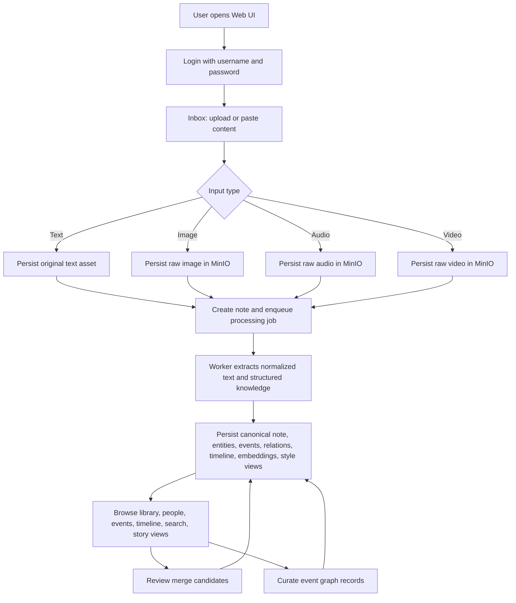
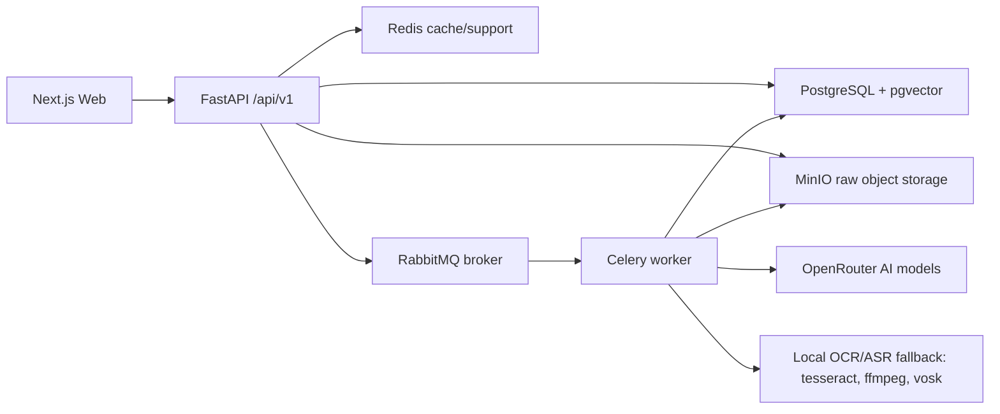
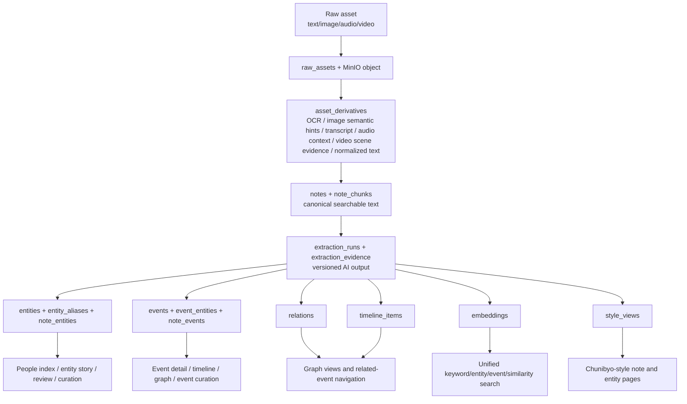
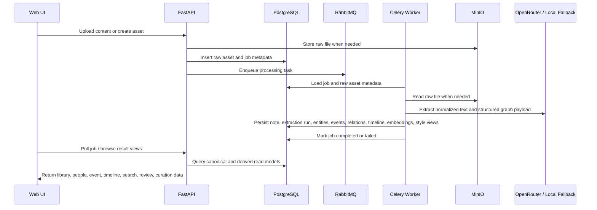

# Current System Overview

Last updated: `2026-04-21`

## Purpose

This document records the current end-to-end shape of the online AI-assisted knowledge base: how users move through the product, how data moves through the system, how processing transforms raw inputs into graph views, and which capabilities are already implemented or still missing.

## Overall Product Flow

## Runtime Service Flow

## Data Flow

## Data Processing Flow

## Implemented Capabilities

- `DONE`: Docker Compose development deployment with PostgreSQL, pgvector, RabbitMQ, Redis, MinIO, API, worker, web, and migration job.
- `DONE`: Alembic migration workflow and release smoke guidance.
- `DONE`: Username/password login with bearer-token auth.
- `DONE`: Raw text, image, audio, and video asset ingestion with raw preservation.
- `DONE`: Image OCR, audio transcription, and video derivative text fallback using local tools.
- `DONE`: Image derivatives now preserve semantic scene, object, action, document-type, and layout hints beyond OCR-only text.
- `DONE`: Audio derivatives now preserve conversation type, speaker hints, topic hints, decisions, follow-ups, and transcript segments beyond flat transcript text.
- `DONE`: Async job tracking and retry flow through Celery and RabbitMQ.
- `DONE`: Note canonicalization, extraction-run persistence, and reprocessing entry point.
- `DONE`: Extraction run history, per-run summary retrieval, and side-by-side diff snapshots for note reprocessing review.
- `DONE`: Historical extraction runs can now be re-applied to the current note projection as an explicit rollback/replay action.
- `DONE`: Replay actions are now audited through note-scoped action history for automatic and manual projection applies.
- `DONE`: Reprocessing now creates `ready_for_review` extraction drafts that require explicit approve or reject before the active projection changes.
- `DONE`: Entity, event, relation, note-link, timeline, and extraction-evidence persistence.
- `DONE`: OpenRouter text extraction with free-model fallback batching and local heuristic fallback.
- `DONE`: Multimodal derivative enrichment now combines local OCR/ASR parsing, image semantic hints, audio context hints, optional OpenRouter enhancement, and source attribution snippets.
- `DONE`: Video derivatives now preserve sampled scene time ranges and label direct OCR/ASR evidence separately from model-inferred context.
- `DONE`: Embedding-backed similarity search, merge-candidate generation, and unified search page.
- `DONE`: People index, library, event pages, timeline/global graph view, note detail, and story views.
- `DONE`: Chunibyo-style note and entity story views stored separately from canonical data.
- `DONE`: Merge review queue with accept/reject, entity merge, event merge, alias confirmation, and audit history.
- `DONE`: Event curation page and API for event fields, participants, and event-centered relation add/update/remove.
- `DONE`: Entity curation page and API for canonical/display fields, type, status, seen timestamps, alias governance, and entity-centered relation maintenance.
- `DONE`: Operations dashboard foundation for jobs, retries, raw assets, derivative summaries, and note extraction-run inspection.
- `DONE`: Operations console now has `/api/v1/operations/overview` and a backlog radar for failed jobs, reviewable extraction drafts, pending merge candidates, asset type distribution, and recent operator actions.
- `DONE`: Core note replay, review, and curation write APIs now use explicit Pydantic request schemas with OpenAPI contract coverage.
- `DONE`: Auth, asset, job, note, entity, event, timeline, and story-view core read APIs now publish explicit response schemas, including pagination envelopes, graph overview payloads, and extraction replay diff structures.
- `DONE`: Search, review, and curation aggregation APIs now also publish explicit response schemas for unified search, merge-candidate review, review context, curation context, and relation/participant edit results.
- `DONE`: Note, entity, event, and timeline read APIs now compose payloads through dedicated query services instead of route-level query assembly.
- `DONE`: Phase A source-of-truth cleanup is now applied. `entity_aliases` is the canonical alias store, `embeddings` is the canonical vector store, and `event_entities` is the canonical participant store.
- `DONE`: Participant facts are no longer duplicated into `relations(participates_in)`, which keeps graph semantics cleaner for future governance and replay.
- `DONE`: Phase B extraction/projection versioning is now applied. Extraction runs carry provider/model/prompt/schema/input lineage metadata, immutable `projection_versions` record each apply action, and notes now track the active projection explicitly.
- `DONE`: Replay audit payloads now include projection-version ids and version metadata so draft approval, manual rollback, and auto-apply flows can be traced more safely.
- `DONE`: Architecture V2 Phase C is now underway. The first three domain-packaging slices introduced `app.domains.extraction` and `app.domains.replay`, moved extraction metadata, extraction payload orchestration, worker pipeline, replay diff logic, and replay service behavior behind those packages, and kept compatibility shims so behavior stayed stable during the transition.
- `DONE`: Event detail and entity story pages now include a first graph-workspace slice for event associations and people timeline fragments.
- `DONE`: Phase 26 Slice A now adds a shared `/graph` workspace route and `/api/v1/graph/workspace` read model so event, entity, and overview anchors can enter one unified graph shell.
- `DONE`: Phase 26 Slice B now adds URL-driven node focus, a unified node inspector, and `/api/v1/graph/nodes/{node_type}/{node_id}` detail payloads so graph navigation can stay inside one workspace.
- `DONE`: Phase 26 Slice C now adds inline relation editing and event-participant editing inside the shared graph workspace, with local refresh after each mutation.
- `DONE`: Phase 26 Slice D now fuses timeline backbone navigation into the shared graph shell with mode filters and in-workspace timeline-node selection.
- `DONE`: Phase 26 Slice E now hardens the shared graph workspace with skeleton loading states, empty-state fallback, stronger mobile focus cues, and clearer inline validation feedback.
- `DONE`: Phase 26 now also lets visible graph edges be focused as first-class interaction targets, with edge spotlight cards and quick node pivot actions inside the shared workspace.
- `DONE`: Current visual token system and brutalist page styling pass.

## Unimplemented Or Partial Capabilities By Priority

1. `MEDIUM`: Domain packaging is partially implemented. Extraction and replay now have real `app.domains.*` implementations, but projection, knowledge, governance, retrieval, and operations concerns are still only partly migrated out of the horizontal `services` layer.
2. `MEDIUM`: Graph workspace and canvas-style editing are still incomplete. Shared exploration, inline governance, timeline-backbone fusion, and UX hardening are now in place, but broader canvas-native editing is still missing.
3. `MEDIUM`: Back-office operations depth is still incomplete. The console now has backlog and activity signals, but raw asset management actions, queue latency analytics, and broader admin workflows are still thin.
4. `LOW`: Collaboration and permissions. Current implementation is single-user/workspace oriented.
5. `LOW`: Plugin and integration system for external importers and third-party sync.
6. `LOW`: Mobile-first ingestion and browsing experience.

## Next Development Direction

The next implementation slice should continue blueprint Phase C while preserving the new versioning model. The expected scope is:

- move more replay/apply logic out of `extraction_run_service.py` into dedicated replay or projection domain modules
- keep reorganizing backend modules toward domain-first packaging without breaking the current `/api/v1` surface
- preserve the projection-version pointer model while splitting extraction, replay, projection, and read concerns further
- keep shrinking legacy compatibility shims as concrete domain implementations take over
- choose the next backend seam from projection, retrieval/read models, or governance services instead of adding more horizontal helpers
- keep `/api/v1/graph/*`, `/api/v1/operations/*`, and replay-related response schemas explicit in OpenAPI
