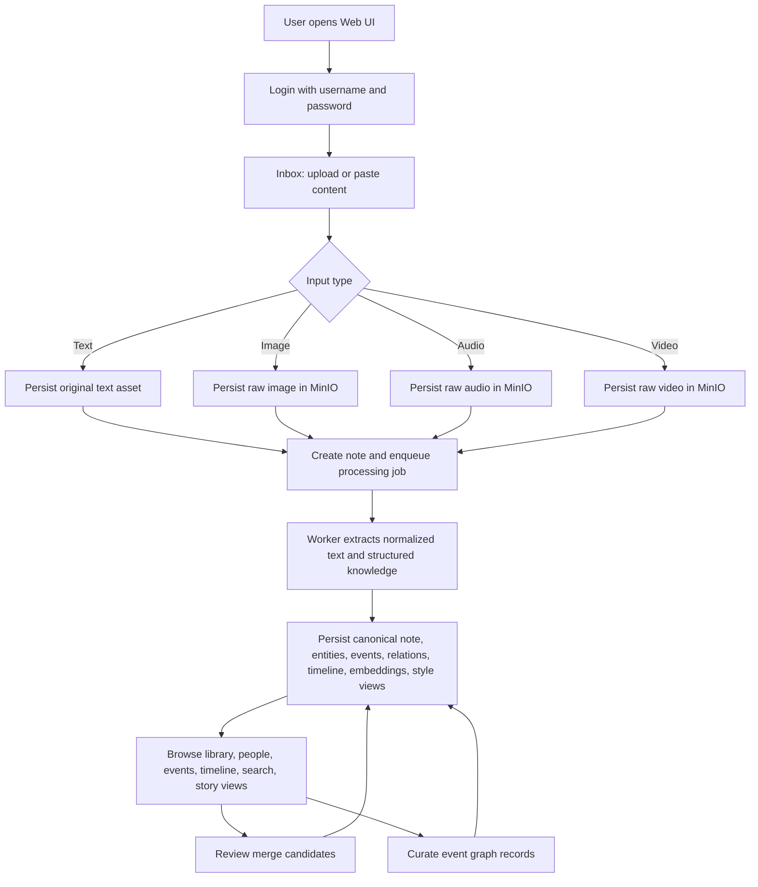
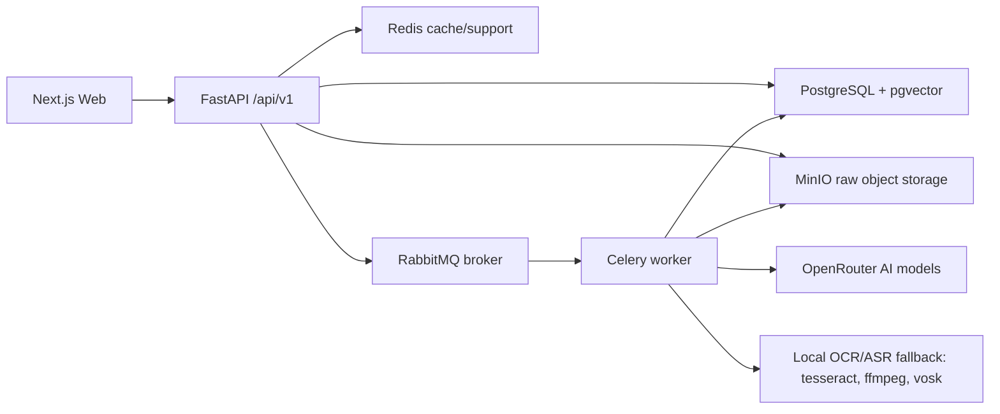
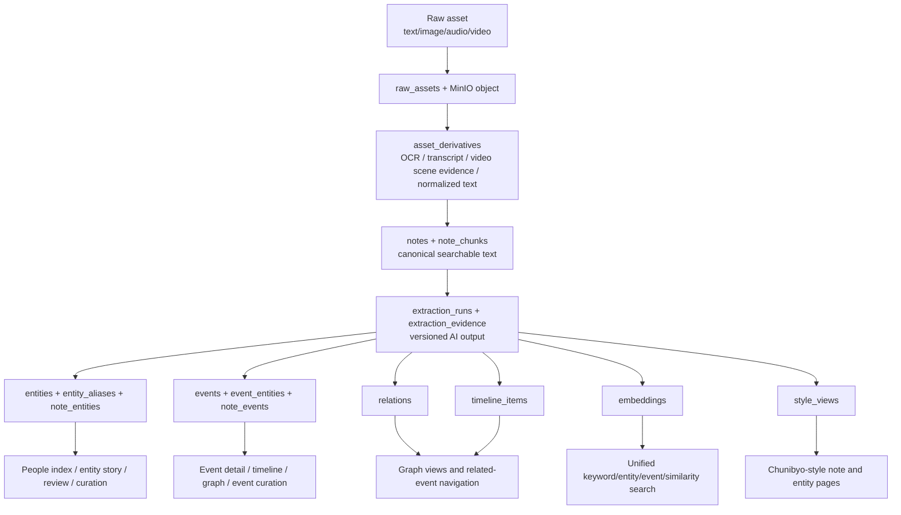
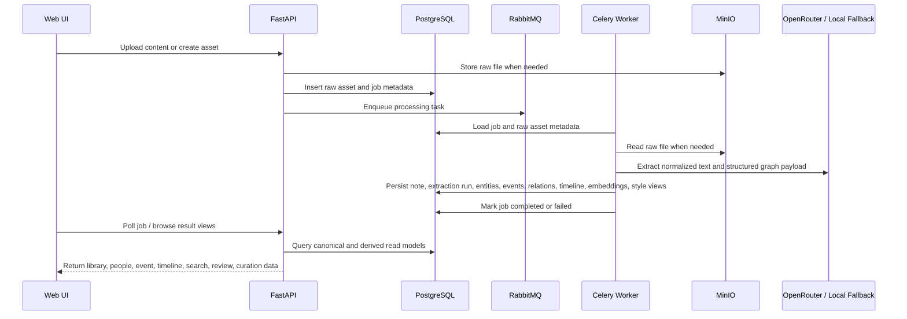

# Current System Overview

Last updated: `2026-04-19`

## Purpose

This document records the current end-to-end shape of the online AI-assisted knowledge base: how users move through the product, how data moves through the system, how processing transforms raw inputs into graph views, and which capabilities are already implemented or still missing.

## Overall Product Flow

## Runtime Service Flow

## Data Flow

## Data Processing Flow

## Implemented Capabilities

- `DONE`: Docker Compose development deployment with PostgreSQL, pgvector, RabbitMQ, Redis, MinIO, API, worker, web, and migration job.
- `DONE`: Alembic migration workflow and release smoke guidance.
- `DONE`: Username/password login with bearer-token auth.
- `DONE`: Raw text, image, audio, and video asset ingestion with raw preservation.
- `DONE`: Image OCR, audio transcription, and video derivative text fallback using local tools.
- `DONE`: Async job tracking and retry flow through Celery and RabbitMQ.
- `DONE`: Note canonicalization, extraction-run persistence, and reprocessing entry point.
- `DONE`: Extraction run history, per-run summary retrieval, and side-by-side diff snapshots for note reprocessing review.
- `DONE`: Historical extraction runs can now be re-applied to the current note projection as an explicit rollback/replay action.
- `DONE`: Entity, event, relation, note-link, timeline, and extraction-evidence persistence.
- `DONE`: OpenRouter text extraction with free-model fallback batching and local heuristic fallback.
- `DONE`: Multimodal derivative enrichment now combines local OCR/ASR parsing with optional OpenRouter enhancement and source attribution snippets.
- `DONE`: Video derivatives now preserve sampled scene time ranges and label direct OCR/ASR evidence separately from model-inferred context.
- `DONE`: Embedding-backed similarity search, merge-candidate generation, and unified search page.
- `DONE`: People index, library, event pages, timeline/global graph view, note detail, and story views.
- `DONE`: Chunibyo-style note and entity story views stored separately from canonical data.
- `DONE`: Merge review queue with accept/reject, entity merge, event merge, alias confirmation, and audit history.
- `DONE`: Event curation page and API for event fields, participants, and event-centered relation add/update/remove.
- `DONE`: Entity curation page and API for canonical/display fields, type, status, seen timestamps, alias governance, and entity-centered relation maintenance.
- `DONE`: Current visual token system and brutalist page styling pass.

## Unimplemented Or Partial Capabilities By Priority

1. `HIGH`: Multimodal quality upgrade is still incomplete. The pipeline now preserves local parsing, AI enhancement, source attribution, and video scene evidence together, but image semantics and speaker/context extraction are still MVP-grade.
2. `HIGH`: Extraction replay and version comparison. Run history, side-by-side extraction diffs, and manual historical re-apply now exist, but draft replay approval and explicit rollback audit workflow are not complete.
3. `MEDIUM`: Back-office operations dashboard. Job monitoring, failed-task retry center, raw asset management, and extraction-run inspection still require developer-level visibility.
4. `MEDIUM`: Strongly typed API contracts across all public endpoints. Some endpoints still accept generic dictionaries and should move toward explicit request/response schemas.
5. `MEDIUM`: Dedicated read-model query service layer. Several route files still compose read data directly instead of using dedicated query services.
6. `LOW`: Collaboration and permissions. Current implementation is single-user/workspace oriented.
7. `LOW`: Plugin and integration system for external importers and third-party sync.
8. `LOW`: Mobile-first ingestion and browsing experience.

## Next Development Direction

The next implementation slice should continue multimodal understanding quality work, now focusing on non-video semantic depth and better extraction replay controls. The expected scope is:

- strengthen image semantic extraction beyond OCR-only signals
- improve audio speaker/context extraction
- version multimodal prompts and normalize richer derivative payloads
- add draft replay approval and rollback audit controls before applying new projections
